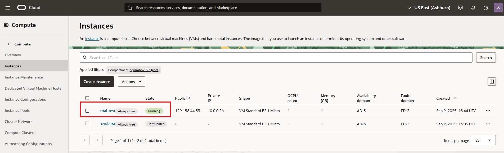
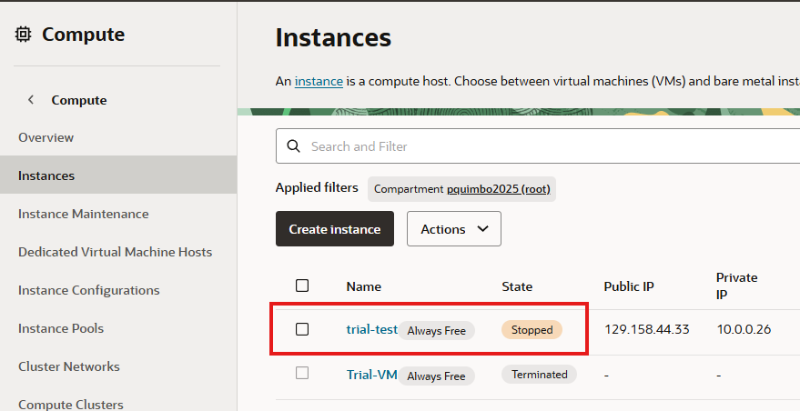

# VM Lifecycle on GCP and OCI — Tutorial

## Video
### How to Create VM in Oracle-OCI
[OCI-how-to] https://www.loom.com/share/defdc64ccc814d47aad53246da9ae163

### How to Create VM in Google-GCP
[GCP-how-to] https://www.loom.com/share/0071f9bbc61f4b90be84ed6adb1ee56c

## Prereqs
- Cloud access to GCP and OCI
- No PHI/PII; smallest/free-tier shapes

---
## Oracle Cloud (OCI)
### Create
1. Compartment: <name>
2. Networking: VCN with Internet Connectivity (defaults)
3. Shape: <smallest/free-eligible>
4. Image: Ubuntu (or Oracle Linux)
5. Public IP: ephemeral
6. Boot volume: default minimal

OCI create (images/Oracle_create.png)

### Start/Stop
- Start: (images/Oracle_start.png)
- Stop: (images/Oracle_stoppedstatus.png)

### Terminate
- Terminate and delete boot volume; verify cleanup

---

## Google Cloud (GCP)
### Create
1. Console → Compute Engine → Create instance
2. Region/zone: <your choice>
3. Machine type: <smallest available/free-eligible>
4. Image: Ubuntu LTS
5. Boot disk: default minimal
6. Network: default VPC; ephemeral public IP

### Start/Stop
- Start: <state shows RUNNING>
- Stop: <state shows TERMINATED/STOPPED>

### Delete
- Delete instance and verify no disks/IPs remain

---

## Reflections
### Similarities
* Regions and Zone Selection
* Creating Machine Specificition
* Managing VM function (starting, stopping, monitoring, deleting)

### Differences
* User interface
* Pricing/Rates
* Storage Choices
* OS Selections (number of selections)

### Preference (OCI vs GCP) and Why
I’d choose Google Cloud Platform (GCP) over Oracle Cloud (OCI) because GCP is much easier to use when you're just starting out. Its interface is clean and simple to navigate, and setting up a virtual machine takes only a few steps. You don’t need to understand complex networking or enterprise-level settings to get things running. GCP is designed with developers in mind, making it a smoother and more approachable option for learning cloud technology from the ground up.

