# VM Lifecycle on GCP and OCI — Tutorial

## Video Walkthroughs

### Oracle Cloud (OCI)
[▶️ How to Create a VM in OCI](https://www.loom.com/share/defdc64ccc814d47aad53246da9ae163)

### Google Cloud Platform (GCP)
[▶️ How to Create a VM in GCP](https://www.loom.com/share/0071f9bbc61f4b90be84ed6adb1ee56c)

---

## Prerequisites
- Access to GCP and OCI cloud consoles  
- Use smallest/free-tier VM shapes  
- No PHI/PII data involved  

---

## Oracle Cloud Infrastructure (OCI)

### VM Creation Steps
1. **Compartment**: `pquimbo2025`  
2. **Networking**: VCN with default internet connectivity  
3. **Shape**: `VM.Standard.E2.1.Micro`  
4. **Image**: Ubuntu  
5. **Public IP**: Ephemeral  
6. **Boot Volume**: Default minimal  

**Creation Screenshot**  

### Start / Stop VM
- **Start**  
  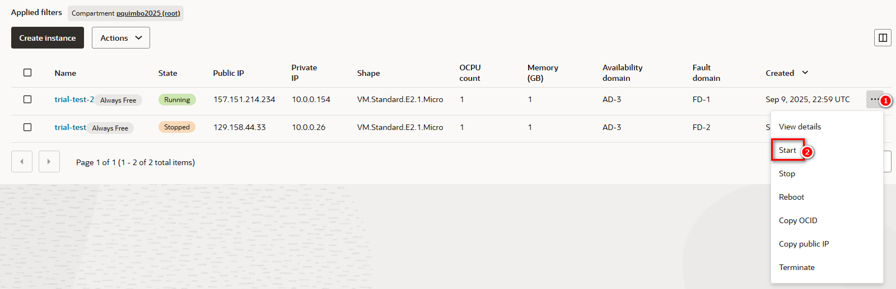  
- **Stop**  
  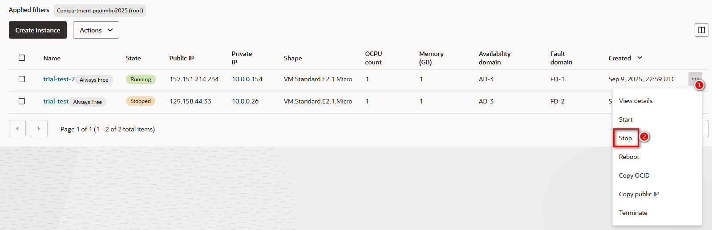
- **Terminate**  
  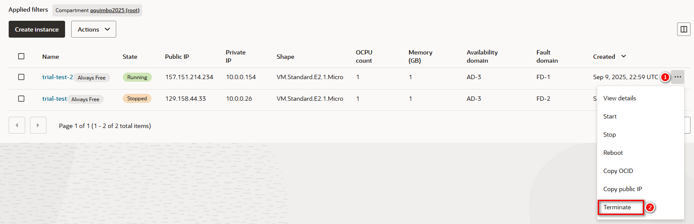

### VM Status
- **Running**  
  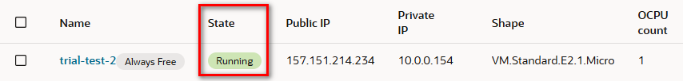  
- **Stopped**  
  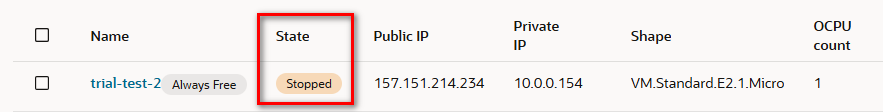
- **Terminated**
  

---

## Google Cloud Platform (GCP)

### VM Creation Steps
1. Navigate to: **Console → Compute Engine → Create Instance**  
2. **Region/Zone**: `us-east4` (Northern Virginia)  
3. **Machine Type**: `e2-micro` (2 vCPU, 1 core, 1 GB memory)  
4. **Image**: Ubuntu LTS  
5. **Boot Disk**: Default minimal  
6. **Network**: Default VPC with ephemeral public IP  

**Creation Screenshot**  

### Start / Stop VM
- **Start**  
  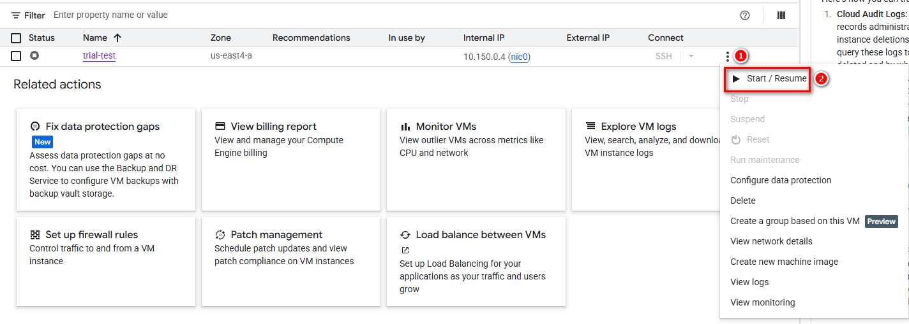  
- **Stop**  
  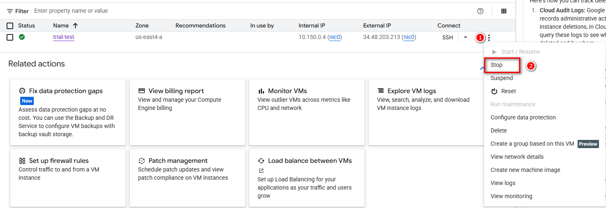
- **Delete**  
  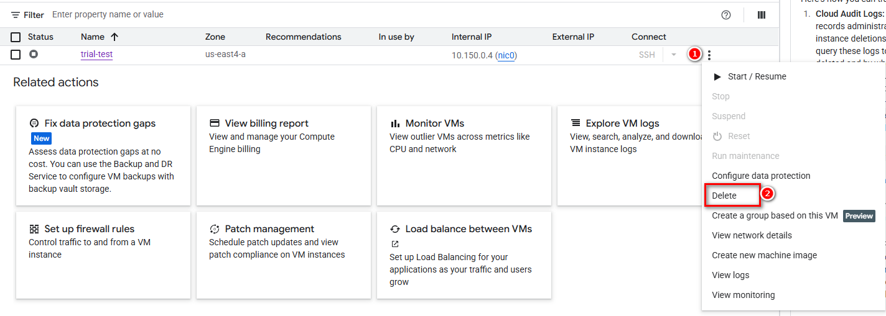

### VM Status
- **Running**  
  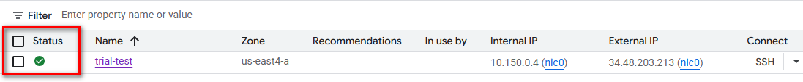  
- **Stopped**  
  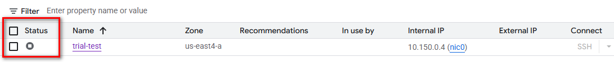

### Delete VM
- Delete instance and verify no disks or IPs remain  
  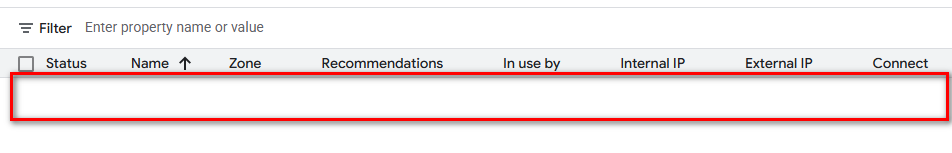

---

## Reflections

### Similarities
- Region and zone selection  
- VM specification setup  
- Lifecycle management: start, stop, monitor, delete  

### Differences
- User interface and navigation  
- Pricing and billing models  
- Storage configuration options  
- OS image variety  

### Personal Preference: GCP vs OCI
> I prefer **Google Cloud Platform (GCP)** over **Oracle Cloud (OCI)** for its beginner-friendly interface and streamlined VM setup. GCP’s clean design and intuitive workflow make it ideal for learning cloud fundamentals without needing deep networking knowledge. It’s built with developers in mind, offering a smoother experience for getting started.